# System Architecture Analysis

## Overview

- **Project**: /home/tom/github/pro-llama/prollama
- **Primary Language**: python
- **Languages**: python: 27, shell: 1
- **Analysis Mode**: static
- **Total Functions**: 142
- **Total Classes**: 45
- **Modules**: 28
- **Entry Points**: 132

## Architecture by Module

### src.prollama.shell
- **Functions**: 15
- **Classes**: 1
- **File**: `shell.py`

### src.prollama.cli
- **Functions**: 13
- **File**: `cli.py`

### examples.sample_code.ecommerce
- **Functions**: 11
- **Classes**: 3
- **File**: `ecommerce.py`

### src.prollama.anonymizer.ast_layer
- **Functions**: 9
- **Classes**: 1
- **File**: `ast_layer.py`

### src.prollama.executor.task_executor
- **Functions**: 9
- **Classes**: 1
- **File**: `task_executor.py`

### examples.sample_code.ml_pipeline
- **Functions**: 8
- **Classes**: 2
- **File**: `ml_pipeline.py`

### examples.sample_code.api_secrets
- **Functions**: 8
- **Classes**: 2
- **File**: `api_secrets.py`

### src.prollama.tickets
- **Functions**: 8
- **Classes**: 3
- **File**: `tickets.py`

### examples.sample_code.fintech_app
- **Functions**: 7
- **Classes**: 2
- **File**: `fintech_app.py`

### src.prollama.anonymizer.nlp_layer
- **Functions**: 7
- **Classes**: 1
- **File**: `nlp_layer.py`

### src.prollama.core
- **Functions**: 6
- **Classes**: 1
- **File**: `core.py`

### src.prollama.config
- **Functions**: 6
- **Classes**: 6
- **File**: `config.py`

### examples.sample_code.healthcare_app
- **Functions**: 5
- **Classes**: 2
- **File**: `healthcare_app.py`

### src.prollama.proxy
- **Functions**: 5
- **Classes**: 2
- **File**: `proxy.py`

### src.prollama.anonymizer.regex_layer
- **Functions**: 5
- **Classes**: 2
- **File**: `regex_layer.py`

### src.prollama.anonymizer.pipeline
- **Functions**: 5
- **Classes**: 1
- **File**: `pipeline.py`

### src.prollama.router.model_router
- **Functions**: 5
- **Classes**: 2
- **File**: `model_router.py`

### src.prollama.llm
- **Functions**: 5
- **Classes**: 3
- **File**: `llm.py`

### examples.batch_scan
- **Functions**: 2
- **File**: `batch_scan.py`

### examples.anonymize_code
- **Functions**: 2
- **File**: `anonymize_code.py`

## Key Entry Points

Main execution flows into the system:

### examples.routing_demo.demo_routing
> Demonstrate model selection and escalation.
- **Calls**: Config, ModelRouter, console.print, Table, table.add_column, table.add_column, table.add_column, table.add_column

### src.prollama.config.Config.load
> Load config from YAML, .env, and environment variables.

Priority: env vars > .env file > config.yaml > defaults
- **Calls**: path.exists, api_keys.items, cls, cls, os.getenv, os.getenv, int, os.getenv

### src.prollama.cli.anonymize
> Anonymize a source file and show results.
- **Calls**: main.command, click.argument, click.option, click.option, src.prollama.cli._load_config, None.read_text, AnonymizationPipeline, pipeline.run

### src.prollama.cli.solve
> Solve a coding task using LLM orchestration.
- **Calls**: main.command, click.argument, click.option, click.option, click.option, click.option, src.prollama.cli._load_config, Task

### src.prollama.shell.ProllamaShell._cmd_solve
> Solve a task. Usage: solve <description> [--file PATH] [--error MSG]
- **Calls**: None.join, Task, src.prollama.executor.task_executor.classify_complexity, src.prollama.executor.task_executor.classify_type, TaskExecutor, executor.router.select, self.console.print, self.console.print

### src.prollama.cli.status
> Show prollama status and configuration.
- **Calls**: main.command, src.prollama.cli._load_config, src.prollama.cli._print_banner, Table, table.add_column, table.add_column, table.add_row, table.add_row

### src.prollama.executor.task_executor.TaskExecutor.solve
> Run the full solve loop for a task.
- **Calls**: time.monotonic, src.prollama.executor.task_executor.classify_type, self.router.select, self._build_context, self.pipeline.run, range, TaskResult, src.prollama.executor.task_executor.classify_complexity

### src.prollama.cli.start
> Start the prollama proxy server.
- **Calls**: main.command, click.option, click.option, src.prollama.cli._load_config, console.print, console.print, console.print, console.print

### src.prollama.shell.ProllamaShell._cmd_anonymize
> Anonymize a file. Usage: anonymize <file>
- **Calls**: Path, file_path.read_text, AnonymizationPipeline, pipeline.run, self.console.print, self.console.print, self.console.print, file_path.exists

### src.prollama.shell.ProllamaShell._cmd_history
> Show task history for this session.
- **Calls**: Table, table.add_column, table.add_column, table.add_column, table.add_column, table.add_column, table.add_column, enumerate

### src.prollama.anonymizer.ast_layer.ASTAnonymizer.anonymize
> Parse code and anonymize business-logic identifiers.

Returns (anonymized_code, mappings_for_rehydration).
- **Calls**: tree_sitter.Parser, self._get_language, code.encode, parser.parse, self._walk_tree, set, unique.sort, code_bytes.decode

### src.prollama.shell.ProllamaShell._cmd_models
> List available models across all providers.
- **Calls**: ModelRouter, router.available_models, Table, table.add_column, table.add_column, table.add_column, table.add_column, table.add_column

### src.prollama.anonymizer.ast_layer.ASTAnonymizer._walk_tree
> Recursively walk AST and collect identifier replacements.
- **Calls**: LANGUAGE_TARGETS.get, LANGUAGE_BUILTINS.get, None.decode, self._is_import_context, self._is_decorator_context, self._get_replacement, replacements.append, self._walk_tree

### src.prollama.executor.task_executor.TaskExecutor._call_llm
> Send a completion request to the model's provider. Returns (response, cost).
- **Calls**: self.config.get_provider, self._default_base_url, provider.resolve_api_key, self._http.post, resp.raise_for_status, resp.json, None.get, None.get

### src.prollama.shell.ProllamaShell._cmd_providers
> List configured providers.
- **Calls**: Table, table.add_column, table.add_column, table.add_column, table.add_column, self.console.print, self.console.print, self.console.print

### src.prollama.tickets.TicketManager._github_list_tickets
> List GitHub issues
- **Calls**: ValueError, self.client.get, response.raise_for_status, response.json, Ticket, tickets.append, console.print, issue.get

### src.prollama.tickets.TicketManager._github_update_ticket
> Update GitHub issue
- **Calls**: ValueError, self.client.patch, response.raise_for_status, response.json, Ticket, kwargs.items, console.print, result.get

### src.prollama.cli.init
> Initialize prollama configuration.
- **Calls**: main.command, click.option, Path, config_path.exists, Config.write_template, console.print, console.print, console.print

### src.prollama.tickets.TicketManager._github_create_ticket
> Create GitHub issue
- **Calls**: ValueError, self.client.post, response.raise_for_status, response.json, Ticket, console.print, result.get, None.get

### examples.anonymize_code.main
- **Calls**: examples.anonymize_code.anonymize_and_compare, len, default.exists, sys.argv.index, str, console.print, sys.exit, len

### src.prollama.shell.ProllamaShell._cmd_status
> Show current session status.
- **Calls**: self.console.print, self.console.print, self.console.print, self.console.print, self.console.print, self.console.print, len, None.join

### src.prollama.anonymizer.nlp_layer.NLPAnonymizer._anonymize_presidio
> Use Presidio for PII detection.
- **Calls**: AnalyzerEngine, analyzer.analyze, sorted, self._next_token, mappings.append, AnonymizationMapping, result.find, result.find

### src.prollama.anonymizer.pipeline.AnonymizationPipeline.run
> Run anonymization pipeline and return result with mappings.
- **Calls**: self._regex.anonymize, all_mappings.extend, AnonymizationResult, AnonymizationResult, self._run_nlp, all_mappings.extend, self._run_ast, all_mappings.extend

### examples.sample_code.api_secrets.WebhookHandler.process_payment_event
> Process Stripe payment webhook event.
- **Calls**: None.get, None.get, None.isoformat, None.get, None.get, datetime.utcnow, event.get, event.get

### src.prollama.cli.main
> prollama — Intelligent LLM Execution Layer for developer teams.
- **Calls**: click.group, click.option, click.option, ctx.ensure_object, console.print, ctx.exit, src.prollama.cli._print_banner, console.print

### src.prollama.core.ProllamaCore.load_config
> Load configuration from YAML file
- **Calls**: Path, config_file.exists, console.print, self.get_default_config, console.print, open, console.print, yaml.safe_load

### src.prollama.anonymizer.regex_layer.RegexAnonymizer.anonymize
> Return (anonymized_code, mappings).

Mappings can later be used for rehydration (restoring originals).
- **Calls**: pattern.regex.finditer, match.group, self._next_token, mappings.append, result.replace, original.startswith, original.endswith, AnonymizationMapping

### src.prollama.llm.LLMInterface._openai_chat
> OpenAI chat completion
- **Calls**: ValueError, self.client.post, response.raise_for_status, response.json, LLMResponse, msg.model_dump, console.print, result.get

### examples.sample_code.ecommerce.PaymentGateway.process_payment
> Process payment through selected gateway.
- **Calls**: self._generate_transaction_id, ValueError, float, float, float, None.isoformat, datetime.utcnow

### src.prollama.shell.ProllamaShell.run
> Start the interactive shell.
- **Calls**: self._print_welcome, None.strip, self._dispatch, self.console.print, self._cmd_exit, self.session.prompt, HTML

## Process Flows

Key execution flows identified:

### Flow 1: demo_routing
```
demo_routing [examples.routing_demo]
```

### Flow 2: load
```
load [src.prollama.config.Config]
```

### Flow 3: anonymize
```
anonymize [src.prollama.cli]
  └─> _load_config
```

### Flow 4: solve
```
solve [src.prollama.cli]
```

### Flow 5: _cmd_solve
```
_cmd_solve [src.prollama.shell.ProllamaShell]
  └─ →> classify_complexity
  └─ →> classify_type
```

### Flow 6: status
```
status [src.prollama.cli]
  └─> _load_config
  └─> _print_banner
```

### Flow 7: start
```
start [src.prollama.cli]
  └─> _load_config
```

### Flow 8: _cmd_anonymize
```
_cmd_anonymize [src.prollama.shell.ProllamaShell]
```

### Flow 9: _cmd_history
```
_cmd_history [src.prollama.shell.ProllamaShell]
```

### Flow 10: _cmd_models
```
_cmd_models [src.prollama.shell.ProllamaShell]
```

## Key Classes

### src.prollama.shell.ProllamaShell
> Interactive REPL for prollama.
- **Methods**: 15
- **Key Methods**: src.prollama.shell.ProllamaShell.__init__, src.prollama.shell.ProllamaShell.run, src.prollama.shell.ProllamaShell._dispatch, src.prollama.shell.ProllamaShell._cmd_solve, src.prollama.shell.ProllamaShell._cmd_anonymize, src.prollama.shell.ProllamaShell._cmd_status, src.prollama.shell.ProllamaShell._cmd_providers, src.prollama.shell.ProllamaShell._cmd_models, src.prollama.shell.ProllamaShell._cmd_config, src.prollama.shell.ProllamaShell._cmd_history

### src.prollama.anonymizer.ast_layer.ASTAnonymizer
> Anonymize identifiers in source code using tree-sitter AST parsing.

Replaces class names, function 
- **Methods**: 9
- **Key Methods**: src.prollama.anonymizer.ast_layer.ASTAnonymizer.anonymize, src.prollama.anonymizer.ast_layer.ASTAnonymizer.rehydrate, src.prollama.anonymizer.ast_layer.ASTAnonymizer.reset, src.prollama.anonymizer.ast_layer.ASTAnonymizer._get_language, src.prollama.anonymizer.ast_layer.ASTAnonymizer._walk_tree, src.prollama.anonymizer.ast_layer.ASTAnonymizer._is_import_context, src.prollama.anonymizer.ast_layer.ASTAnonymizer._is_decorator_context, src.prollama.anonymizer.ast_layer.ASTAnonymizer._get_replacement, src.prollama.anonymizer.ast_layer.ASTAnonymizer._classify_identifier

### src.prollama.tickets.TicketManager
> Manager for ticket operations across different providers
- **Methods**: 8
- **Key Methods**: src.prollama.tickets.TicketManager.__init__, src.prollama.tickets.TicketManager.create_ticket, src.prollama.tickets.TicketManager._github_create_ticket, src.prollama.tickets.TicketManager.list_tickets, src.prollama.tickets.TicketManager._github_list_tickets, src.prollama.tickets.TicketManager.update_ticket, src.prollama.tickets.TicketManager._github_update_ticket, src.prollama.tickets.TicketManager.close

### src.prollama.anonymizer.nlp_layer.NLPAnonymizer
> Detect and anonymize PII in code comments and string literals.

Uses Presidio if available, otherwis
- **Methods**: 7
- **Key Methods**: src.prollama.anonymizer.nlp_layer.NLPAnonymizer.__init__, src.prollama.anonymizer.nlp_layer.NLPAnonymizer.anonymize, src.prollama.anonymizer.nlp_layer.NLPAnonymizer.reset, src.prollama.anonymizer.nlp_layer.NLPAnonymizer._check_presidio, src.prollama.anonymizer.nlp_layer.NLPAnonymizer._anonymize_presidio, src.prollama.anonymizer.nlp_layer.NLPAnonymizer._anonymize_heuristic, src.prollama.anonymizer.nlp_layer.NLPAnonymizer._next_token

### src.prollama.executor.task_executor.TaskExecutor
> Orchestrate the full task-solving loop.
- **Methods**: 7
- **Key Methods**: src.prollama.executor.task_executor.TaskExecutor.__init__, src.prollama.executor.task_executor.TaskExecutor.solve, src.prollama.executor.task_executor.TaskExecutor._build_context, src.prollama.executor.task_executor.TaskExecutor._call_llm, src.prollama.executor.task_executor.TaskExecutor._run_tests, src.prollama.executor.task_executor.TaskExecutor._fail, src.prollama.executor.task_executor.TaskExecutor._default_base_url

### src.prollama.core.ProllamaCore
> Main core class for Prollama functionality
- **Methods**: 6
- **Key Methods**: src.prollama.core.ProllamaCore.__init__, src.prollama.core.ProllamaCore.load_config, src.prollama.core.ProllamaCore.get_default_config, src.prollama.core.ProllamaCore.save_config, src.prollama.core.ProllamaCore.get_config_value, src.prollama.core.ProllamaCore.set_config_value

### src.prollama.config.Config
> Root configuration for prollama.
- **Methods**: 6
- **Key Methods**: src.prollama.config.Config.load, src.prollama.config.Config.save, src.prollama.config.Config.write_template, src.prollama.config.Config.proxy_url, src.prollama.config.Config.get_provider, src.prollama.config.Config.provider_names
- **Inherits**: BaseModel

### examples.sample_code.ml_pipeline.MLModelManager
> Manages ML model lifecycle including training and deployment.

Lead: Dr. Robert Chen (Chief Scientis
- **Methods**: 5
- **Key Methods**: examples.sample_code.ml_pipeline.MLModelManager.__init__, examples.sample_code.ml_pipeline.MLModelManager.download_training_data, examples.sample_code.ml_pipeline.MLModelManager.upload_model, examples.sample_code.ml_pipeline.MLModelManager.log_experiment, examples.sample_code.ml_pipeline.MLModelManager.get_feature_vector

### examples.sample_code.api_secrets.APIClientManager
> Manages multiple API clients with secure authentication.

Owner: Sarah Williams (DevOps Lead)
Last s
- **Methods**: 5
- **Key Methods**: examples.sample_code.api_secrets.APIClientManager.__init__, examples.sample_code.api_secrets.APIClientManager.generate_jwt_token, examples.sample_code.api_secrets.APIClientManager.verify_jwt_token, examples.sample_code.api_secrets.APIClientManager.rotate_api_key, examples.sample_code.api_secrets.APIClientManager.connect_to_mongodb

### src.prollama.anonymizer.regex_layer.RegexAnonymizer
> Apply regex-based anonymization to source code text.
- **Methods**: 5
- **Key Methods**: src.prollama.anonymizer.regex_layer.RegexAnonymizer.__init__, src.prollama.anonymizer.regex_layer.RegexAnonymizer._next_token, src.prollama.anonymizer.regex_layer.RegexAnonymizer.anonymize, src.prollama.anonymizer.regex_layer.RegexAnonymizer.rehydrate, src.prollama.anonymizer.regex_layer.RegexAnonymizer.reset

### src.prollama.anonymizer.pipeline.AnonymizationPipeline
> Orchestrate the anonymization layers according to privacy level.
- **Methods**: 5
- **Key Methods**: src.prollama.anonymizer.pipeline.AnonymizationPipeline.__init__, src.prollama.anonymizer.pipeline.AnonymizationPipeline.run, src.prollama.anonymizer.pipeline.AnonymizationPipeline.rehydrate, src.prollama.anonymizer.pipeline.AnonymizationPipeline._run_nlp, src.prollama.anonymizer.pipeline.AnonymizationPipeline._run_ast

### src.prollama.llm.LLMInterface
> Interface for interacting with LLM providers
- **Methods**: 5
- **Key Methods**: src.prollama.llm.LLMInterface.__init__, src.prollama.llm.LLMInterface.chat, src.prollama.llm.LLMInterface._openai_chat, src.prollama.llm.LLMInterface.simple_chat, src.prollama.llm.LLMInterface.close

### examples.sample_code.fintech_app.AcmePaymentProcessor
> Handles all payment processing for Acme Fintech premium customers.

Reviewed by: Anna Nowak (Senior 
- **Methods**: 4
- **Key Methods**: examples.sample_code.fintech_app.AcmePaymentProcessor.__init__, examples.sample_code.fintech_app.AcmePaymentProcessor.charge_premium_customer, examples.sample_code.fintech_app.AcmePaymentProcessor.refund_transaction, examples.sample_code.fintech_app.AcmePaymentProcessor.verify_webhook

### examples.sample_code.healthcare_app.PatientRecordService
> Manages electronic health records (EHR) for MedTech Solutions.

Created by: James Wilson (Lead Devel
- **Methods**: 4
- **Key Methods**: examples.sample_code.healthcare_app.PatientRecordService.__init__, examples.sample_code.healthcare_app.PatientRecordService.get_patient_record, examples.sample_code.healthcare_app.PatientRecordService.update_diagnosis, examples.sample_code.healthcare_app.PatientRecordService._log_access

### examples.sample_code.ecommerce.PaymentGateway
> Unified payment gateway supporting multiple providers.

Manager: Jennifer Lee (Payments Team)
Suppor
- **Methods**: 4
- **Key Methods**: examples.sample_code.ecommerce.PaymentGateway.__init__, examples.sample_code.ecommerce.PaymentGateway.process_payment, examples.sample_code.ecommerce.PaymentGateway._generate_transaction_id, examples.sample_code.ecommerce.PaymentGateway.refund_payment

### examples.sample_code.ecommerce.NotificationService
> Handles customer notifications via multiple channels.
- **Methods**: 4
- **Key Methods**: examples.sample_code.ecommerce.NotificationService.__init__, examples.sample_code.ecommerce.NotificationService.send_order_confirmation, examples.sample_code.ecommerce.NotificationService.send_sms_notification, examples.sample_code.ecommerce.NotificationService.notify_slack

### src.prollama.router.model_router.ModelRouter
> Select and escalate models based on task complexity and strategy.
- **Methods**: 4
- **Key Methods**: src.prollama.router.model_router.ModelRouter.available_models, src.prollama.router.model_router.ModelRouter.select, src.prollama.router.model_router.ModelRouter.escalate, src.prollama.router.model_router.ModelRouter.estimate_cost

### examples.sample_code.fintech_app.AcmeSubscriptionManager
> Manages recurring subscriptions for Acme Fintech.

Owner: Maria Garcia (Product Lead)
- **Methods**: 3
- **Key Methods**: examples.sample_code.fintech_app.AcmeSubscriptionManager.__init__, examples.sample_code.fintech_app.AcmeSubscriptionManager.upgrade_to_premium, examples.sample_code.fintech_app.AcmeSubscriptionManager.calculate_mrr

### examples.sample_code.ml_pipeline.InferenceService
> Real-time inference service for deployed models.
- **Methods**: 3
- **Key Methods**: examples.sample_code.ml_pipeline.InferenceService.__init__, examples.sample_code.ml_pipeline.InferenceService.predict, examples.sample_code.ml_pipeline.InferenceService.batch_predict

### examples.sample_code.ecommerce.ShippingManager
> Manages shipping calculations and label generation.
- **Methods**: 3
- **Key Methods**: examples.sample_code.ecommerce.ShippingManager.__init__, examples.sample_code.ecommerce.ShippingManager.calculate_shipping, examples.sample_code.ecommerce.ShippingManager.generate_label

## Data Transformation Functions

Key functions that process and transform data:

### examples.sample_code.ecommerce.PaymentGateway.process_payment
> Process payment through selected gateway.
- **Output to**: self._generate_transaction_id, ValueError, float, float, float

### examples.sample_code.api_secrets.WebhookHandler.process_payment_event
> Process Stripe payment webhook event.
- **Output to**: None.get, None.get, None.isoformat, None.get, None.get

## Public API Surface

Functions exposed as public API (no underscore prefix):

- `src.prollama.proxy.create_app` - 62 calls
- `examples.batch_scan.scan_project` - 40 calls
- `examples.routing_demo.demo_routing` - 32 calls
- `src.prollama.config.Config.load` - 32 calls
- `src.prollama.cli.anonymize` - 29 calls
- `src.prollama.cli.solve` - 26 calls
- `examples.anonymize_code.anonymize_and_compare` - 24 calls
- `src.prollama.cli.status` - 20 calls
- `src.prollama.executor.task_executor.TaskExecutor.solve` - 18 calls
- `src.prollama.cli.start` - 15 calls
- `src.prollama.anonymizer.ast_layer.ASTAnonymizer.anonymize` - 14 calls
- `src.prollama.cli.init` - 10 calls
- `examples.anonymize_code.main` - 9 calls
- `src.prollama.anonymizer.pipeline.AnonymizationPipeline.run` - 9 calls
- `examples.sample_code.api_secrets.WebhookHandler.process_payment_event` - 8 calls
- `src.prollama.cli.main` - 8 calls
- `src.prollama.core.ProllamaCore.load_config` - 8 calls
- `src.prollama.anonymizer.regex_layer.RegexAnonymizer.anonymize` - 8 calls
- `examples.sample_code.ecommerce.PaymentGateway.process_payment` - 7 calls
- `src.prollama.shell.ProllamaShell.run` - 7 calls
- `src.prollama.router.model_router.ModelRouter.select` - 7 calls
- `examples.sample_code.ml_pipeline.MLModelManager.get_feature_vector` - 5 calls
- `src.prollama.cli.config_show` - 5 calls
- `src.prollama.anonymizer.pipeline.AnonymizationPipeline.rehydrate` - 5 calls
- `src.prollama.executor.task_executor.classify_complexity` - 5 calls
- `src.prollama.executor.task_executor.classify_type` - 5 calls
- `src.prollama.llm.LLMInterface.simple_chat` - 5 calls
- `examples.batch_scan.main` - 4 calls
- `examples.sample_code.fintech_app.AcmePaymentProcessor.charge_premium_customer` - 4 calls
- `examples.sample_code.api_secrets.APIClientManager.generate_jwt_token` - 4 calls
- `examples.sample_code.api_secrets.WebhookHandler.verify_stripe_signature` - 4 calls
- `src.prollama.cli.shell` - 4 calls
- `src.prollama.core.ProllamaCore.save_config` - 4 calls
- `src.prollama.config.Config.save` - 4 calls
- `examples.sample_code.fintech_app.AcmeSubscriptionManager.calculate_mrr` - 3 calls
- `examples.sample_code.ml_pipeline.MLModelManager.log_experiment` - 3 calls
- `examples.sample_code.ecommerce.ShippingManager.calculate_shipping` - 3 calls
- `src.prollama.cli.config_path` - 3 calls
- `src.prollama.anonymizer.ast_layer.ASTAnonymizer.rehydrate` - 3 calls
- `src.prollama.anonymizer.ast_layer.ASTAnonymizer.reset` - 3 calls

## System Interactions

How components interact:

```mermaid
graph TD
    demo_routing --> Config
    demo_routing --> ModelRouter
    demo_routing --> print
    demo_routing --> Table
    demo_routing --> add_column
    load --> exists
    load --> items
    load --> cls
    load --> getenv
    anonymize --> command
    anonymize --> argument
    anonymize --> option
    anonymize --> _load_config
    solve --> command
    solve --> argument
    solve --> option
    _cmd_solve --> join
    _cmd_solve --> Task
    _cmd_solve --> classify_complexity
    _cmd_solve --> classify_type
    _cmd_solve --> TaskExecutor
    status --> command
    status --> _load_config
    status --> _print_banner
    status --> Table
    status --> add_column
    solve --> monotonic
    solve --> classify_type
    solve --> select
    solve --> _build_context
```



## Reverse Engineering Guidelines

1. **Entry Points**: Start analysis from the entry points listed above
2. **Core Logic**: Focus on classes with many methods
3. **Data Flow**: Follow data transformation functions
4. **Process Flows**: Use the flow diagrams for execution paths
5. **API Surface**: Public API functions reveal the interface

## Context for LLM

Maintain the identified architectural patterns and public API surface when suggesting changes.