# System Architecture Analysis

## Overview

- **Project**: /home/tom/github/pro-llama/prollama
- **Primary Language**: python
- **Languages**: python: 32, shell: 3
- **Analysis Mode**: static
- **Total Functions**: 203
- **Total Classes**: 51
- **Modules**: 35
- **Entry Points**: 175

## Architecture by Module

### src.prollama.cli
- **Functions**: 18
- **File**: `cli.py`

### src.prollama.shell
- **Functions**: 15
- **Classes**: 1
- **File**: `shell.py`

### src.prollama.anonymizer.enhanced_layer
- **Functions**: 15
- **Classes**: 2
- **File**: `enhanced_layer.py`

### src.prollama.security.content_filter
- **Functions**: 13
- **Classes**: 4
- **File**: `content_filter.py`

### src.prollama.auth
- **Functions**: 11
- **File**: `auth.py`

### src.prollama.anonymizer.ast_layer
- **Functions**: 10
- **Classes**: 1
- **File**: `ast_layer.py`

### src.prollama.llm
- **Functions**: 9
- **Classes**: 4
- **File**: `llm.py`

### src.prollama.executor.task_executor
- **Functions**: 9
- **Classes**: 1
- **File**: `task_executor.py`

### src.prollama.integrations.planfile
- **Functions**: 9
- **Classes**: 1
- **File**: `planfile.py`

### examples.sample_code.ml_pipeline
- **Functions**: 8
- **Classes**: 2
- **File**: `ml_pipeline.py`

### examples.sample_code.api_secrets
- **Functions**: 8
- **Classes**: 2
- **File**: `api_secrets.py`

### src.prollama.tickets
- **Functions**: 8
- **Classes**: 3
- **File**: `tickets.py`

### examples.sample_code.fintech_app
- **Functions**: 7
- **Classes**: 2
- **File**: `fintech_app.py`

### src.prollama.proxy
- **Functions**: 7
- **Classes**: 3
- **File**: `proxy.py`

### src.prollama.config
- **Functions**: 7
- **Classes**: 6
- **File**: `config.py`

### src.prollama.pr
- **Functions**: 7
- **File**: `pr.py`

### src.prollama.anonymizer.nlp_layer
- **Functions**: 7
- **Classes**: 1
- **File**: `nlp_layer.py`

### examples.workflow.autodetection_demo
- **Functions**: 6
- **File**: `autodetection_demo.sh`

### src.prollama.core
- **Functions**: 6
- **Classes**: 1
- **File**: `core.py`

### examples.sample_code.healthcare_app
- **Functions**: 5
- **Classes**: 2
- **File**: `healthcare_app.py`

## Key Entry Points

Main execution flows into the system:

### src.prollama.cli.anonymize
> Anonymize a source file and show results.
- **Calls**: main.command, click.argument, click.option, click.option, click.option, src.prollama.cli._load_config, Console, None.read_text

### src.prollama.cli.solve
> Solve a coding task using LLM orchestration.
- **Calls**: main.command, click.argument, click.option, click.option, click.option, click.option, click.option, click.option

### src.prollama.config.Config.load
> Load config from YAML, .env, and environment variables.

Priority: env vars > .env file > config.yaml > defaults
- **Calls**: path.exists, api_keys.items, cls, cls, os.getenv, os.getenv, int, os.getenv

### examples.routing_demo.demo_routing
> Demonstrate model selection and escalation.
- **Calls**: Config, ModelRouter, console.print, Table, table.add_column, table.add_column, table.add_column, table.add_column

### src.prollama.shell.ProllamaShell._cmd_solve
> Solve a task. Usage: solve <description> [--file PATH] [--error MSG]
- **Calls**: None.join, Task, src.prollama.executor.task_executor.classify_complexity, src.prollama.executor.task_executor.classify_type, TaskExecutor, executor.router.select, self.console.print, self.console.print

### src.prollama.cli.status
> Show prollama status and configuration.
- **Calls**: main.command, src.prollama.cli._load_config, src.prollama.cli._print_banner, Table, table.add_column, table.add_column, table.add_row, table.add_row

### src.prollama.executor.task_executor.TaskExecutor.solve
> Run the full solve loop for a task.
- **Calls**: time.monotonic, src.prollama.executor.task_executor.classify_type, self.router.select, self._build_context, range, TaskResult, src.prollama.executor.task_executor.classify_complexity, self._fail

### src.prollama.cli.check
> Check documentation health and system status.
- **Calls**: main.command, console.print, src.prollama.auth.is_logged_in, src.prollama.integrations.planfile.is_planfile_available, src.prollama.cli._load_config, console.print, console.print, src.prollama.pr.get_current_repo

### src.prollama.security.content_filter.ContentFilter.print_detections
> Print detection results in a formatted way.
- **Calls**: self.get_summary, self.console.print, self.console.print, self.console.print, None.items, self.console.print, None.items, self.console.print

### src.prollama.config.Config.auto_add_providers
> Auto-detect and add providers from environment variables.
- **Calls**: api_keys.items, os.getenv, os.getenv, os.getenv, os.getenv, os.getenv, os.getenv, os.getenv

### src.prollama.security.content_filter.ContentFilter._setup_patterns
> Setup regex patterns for detecting sensitive data.
- **Calls**: re.compile, re.compile, re.compile, re.compile, re.compile, re.compile, re.compile, re.compile

### src.prollama.anonymizer.enhanced_layer.EnhancedAnonymizer.print_security_report
> Print formatted security report.
- **Calls**: Console, self.get_security_report, Table, table.add_column, table.add_column, table.add_row, table.add_row, table.add_row

### src.prollama.cli.start
> Start the prollama proxy server.
- **Calls**: main.command, click.option, click.option, src.prollama.cli._load_config, console.print, console.print, console.print, console.print

### src.prollama.shell.ProllamaShell._cmd_anonymize
> Anonymize a file. Usage: anonymize <file>
- **Calls**: Path, file_path.read_text, AnonymizationPipeline, pipeline.run, self.console.print, self.console.print, self.console.print, file_path.exists

### src.prollama.security.content_filter.ContentFilter.filter_content
> Filter content for sensitive data using regex patterns.

Args:
    content: Content to filter
    include_high_entropy: Whether to include high-entrop
- **Calls**: self.patterns.items, self._deduplicate_results, results.sort, pattern.finditer, self.detect_high_entropy_strings, results.extend, self._get_context, DetectionResult

### src.prollama.cli.ticket
> Create GitHub issue via planfile integration.
- **Calls**: main.command, click.argument, click.option, click.option, click.option, src.prollama.integrations.planfile.create_prollama_ticket, src.prollama.integrations.planfile.is_planfile_available, console.print

### src.prollama.shell.ProllamaShell._cmd_history
> Show task history for this session.
- **Calls**: Table, table.add_column, table.add_column, table.add_column, table.add_column, table.add_column, table.add_column, enumerate

### src.prollama.anonymizer.ast_layer.ASTAnonymizer.anonymize
> Parse code and anonymize business-logic identifiers.

Returns (anonymized_code, mappings_for_rehydration).
- **Calls**: tree_sitter.Parser, self._get_language, code.encode, parser.parse, self._walk_tree, set, unique.sort, code_bytes.decode

### src.prollama.shell.ProllamaShell._cmd_models
> List available models across all providers.
- **Calls**: ModelRouter, router.available_models, Table, table.add_column, table.add_column, table.add_column, table.add_column, table.add_column

### src.prollama.security.content_filter.ContentFilter.detect_high_entropy_strings
> Detect high-entropy strings that might be secrets.

Args:
    text: Text to analyze
    min_length: Minimum string length to consider
    
Returns:
  
- **Calls**: re.findall, self._is_common_non_secret, self.calculate_entropy, text.find, min, results.append, str, min

### src.prollama.anonymizer.ast_layer.ASTAnonymizer._walk_tree
> Recursively walk AST and collect identifier replacements.
- **Calls**: LANGUAGE_TARGETS.get, LANGUAGE_BUILTINS.get, None.decode, self._is_import_context, self._is_decorator_context, self._get_replacement, replacements.append, self._walk_tree

### src.prollama.executor.task_executor.TaskExecutor._call_llm
> Send a completion request to the model's provider. Returns (response, cost).
- **Calls**: self.config.get_provider, self._default_base_url, provider.resolve_api_key, self._http.post, resp.raise_for_status, resp.json, None.get, None.get

### src.prollama.cli.sync
> Sync/regenerate documentation and configuration.
- **Calls**: main.command, click.option, console.print, src.prollama.cli._load_config, console.print, console.print, console.print, console.print

### src.prollama.shell.ProllamaShell._cmd_providers
> List configured providers.
- **Calls**: Table, table.add_column, table.add_column, table.add_column, table.add_column, self.console.print, self.console.print, self.console.print

### src.prollama.anonymizer.enhanced_layer.EnhancedAnonymizer._walk_tree
> Walk AST tree and collect identifier replacements.
- **Calls**: LANGUAGE_TARGETS.get, LANGUAGE_BUILTINS.get, set, None.decode, replacements.append, self._walk_tree, len, text.isupper

### src.prollama.tickets.TicketManager._github_list_tickets
> List GitHub issues
- **Calls**: ValueError, self.client.get, response.raise_for_status, response.json, Ticket, tickets.append, console.print, issue.get

### src.prollama.tickets.TicketManager._github_update_ticket
> Update GitHub issue
- **Calls**: ValueError, self.client.patch, response.raise_for_status, response.json, Ticket, kwargs.items, console.print, result.get

### src.prollama.cli.init
> Initialize prollama configuration.
- **Calls**: main.command, click.option, Path, config_path.exists, Config.write_template, console.print, console.print, console.print

### src.prollama.anonymizer.enhanced_layer.EnhancedAnonymizer._apply_ast_anonymization
> Apply AST-based identifier anonymization.
- **Calls**: tree_sitter.Parser, self._get_language, code.encode, parser.parse, self._walk_tree, None.decode, EnhancedAnonymizationMapping, self.mappings.append

### src.prollama.anonymizer.enhanced_layer.EnhancedAnonymizer.get_security_report
> Generate comprehensive security report.
- **Calls**: self._calculate_risk_score, len, len, len, self._generate_recommendations, any, len, len

## Process Flows

Key execution flows identified:

### Flow 1: anonymize
```
anonymize [src.prollama.cli]
```

### Flow 2: solve
```
solve [src.prollama.cli]
```

### Flow 3: load
```
load [src.prollama.config.Config]
```

### Flow 4: demo_routing
```
demo_routing [examples.routing_demo]
```

### Flow 5: _cmd_solve
```
_cmd_solve [src.prollama.shell.ProllamaShell]
  └─ →> classify_complexity
  └─ →> classify_type
```

### Flow 6: status
```
status [src.prollama.cli]
  └─> _load_config
  └─> _print_banner
```

### Flow 7: check
```
check [src.prollama.cli]
  └─> _load_config
  └─ →> is_logged_in
      └─> load_github_token
          └─> get_credentials_path
  └─ →> is_planfile_available
```

### Flow 8: print_detections
```
print_detections [src.prollama.security.content_filter.ContentFilter]
```

### Flow 9: auto_add_providers
```
auto_add_providers [src.prollama.config.Config]
```

### Flow 10: _setup_patterns
```
_setup_patterns [src.prollama.security.content_filter.ContentFilter]
```

## Key Classes

### src.prollama.shell.ProllamaShell
> Interactive REPL for prollama.
- **Methods**: 15
- **Key Methods**: src.prollama.shell.ProllamaShell.__init__, src.prollama.shell.ProllamaShell.run, src.prollama.shell.ProllamaShell._dispatch, src.prollama.shell.ProllamaShell._cmd_solve, src.prollama.shell.ProllamaShell._cmd_anonymize, src.prollama.shell.ProllamaShell._cmd_status, src.prollama.shell.ProllamaShell._cmd_providers, src.prollama.shell.ProllamaShell._cmd_models, src.prollama.shell.ProllamaShell._cmd_config, src.prollama.shell.ProllamaShell._cmd_history

### src.prollama.anonymizer.enhanced_layer.EnhancedAnonymizer
> Enhanced anonymizer combining AST analysis with content filtering.
- **Methods**: 14
- **Key Methods**: src.prollama.anonymizer.enhanced_layer.EnhancedAnonymizer.__init__, src.prollama.anonymizer.enhanced_layer.EnhancedAnonymizer.anonymize, src.prollama.anonymizer.enhanced_layer.EnhancedAnonymizer._apply_content_filtering, src.prollama.anonymizer.enhanced_layer.EnhancedAnonymizer._apply_ast_anonymization, src.prollama.anonymizer.enhanced_layer.EnhancedAnonymizer._apply_fallback_anonymization, src.prollama.anonymizer.enhanced_layer.EnhancedAnonymizer._get_language, src.prollama.anonymizer.enhanced_layer.EnhancedAnonymizer._get_language_library, src.prollama.anonymizer.enhanced_layer.EnhancedAnonymizer._walk_tree, src.prollama.anonymizer.enhanced_layer.EnhancedAnonymizer._apply_replacements, src.prollama.anonymizer.enhanced_layer.EnhancedAnonymizer._get_replacement

### src.prollama.security.content_filter.ContentFilter
> Content filtering system similar to Tabnine Shield.
- **Methods**: 13
- **Key Methods**: src.prollama.security.content_filter.ContentFilter.__init__, src.prollama.security.content_filter.ContentFilter._setup_patterns, src.prollama.security.content_filter.ContentFilter._setup_entropy_thresholds, src.prollama.security.content_filter.ContentFilter.calculate_entropy, src.prollama.security.content_filter.ContentFilter.detect_high_entropy_strings, src.prollama.security.content_filter.ContentFilter._is_common_non_secret, src.prollama.security.content_filter.ContentFilter._get_context, src.prollama.security.content_filter.ContentFilter.filter_content, src.prollama.security.content_filter.ContentFilter._deduplicate_results, src.prollama.security.content_filter.ContentFilter.sanitize_content

### src.prollama.anonymizer.ast_layer.ASTAnonymizer
> Anonymize identifiers in source code using tree-sitter AST parsing.

Replaces class names, function 
- **Methods**: 10
- **Key Methods**: src.prollama.anonymizer.ast_layer.ASTAnonymizer.anonymize, src.prollama.anonymizer.ast_layer.ASTAnonymizer.rehydrate, src.prollama.anonymizer.ast_layer.ASTAnonymizer.reset, src.prollama.anonymizer.ast_layer.ASTAnonymizer.detect_secrets, src.prollama.anonymizer.ast_layer.ASTAnonymizer._get_language, src.prollama.anonymizer.ast_layer.ASTAnonymizer._walk_tree, src.prollama.anonymizer.ast_layer.ASTAnonymizer._is_import_context, src.prollama.anonymizer.ast_layer.ASTAnonymizer._is_decorator_context, src.prollama.anonymizer.ast_layer.ASTAnonymizer._get_replacement, src.prollama.anonymizer.ast_layer.ASTAnonymizer._classify_identifier

### src.prollama.integrations.planfile.PlanfileAdapter
> Adapter for planfile integration in prollama.

Provides GitHub issue/ticket management using planfil
- **Methods**: 8
- **Key Methods**: src.prollama.integrations.planfile.PlanfileAdapter.__init__, src.prollama.integrations.planfile.PlanfileAdapter._detect_repo, src.prollama.integrations.planfile.PlanfileAdapter._load_token, src.prollama.integrations.planfile.PlanfileAdapter.backend, src.prollama.integrations.planfile.PlanfileAdapter.create_ticket, src.prollama.integrations.planfile.PlanfileAdapter.list_tickets, src.prollama.integrations.planfile.PlanfileAdapter.update_ticket, src.prollama.integrations.planfile.PlanfileAdapter.get_ticket

### src.prollama.tickets.TicketManager
> Manager for ticket operations across different providers
- **Methods**: 8
- **Key Methods**: src.prollama.tickets.TicketManager.__init__, src.prollama.tickets.TicketManager.create_ticket, src.prollama.tickets.TicketManager._github_create_ticket, src.prollama.tickets.TicketManager.list_tickets, src.prollama.tickets.TicketManager._github_list_tickets, src.prollama.tickets.TicketManager.update_ticket, src.prollama.tickets.TicketManager._github_update_ticket, src.prollama.tickets.TicketManager.close

### src.prollama.config.Config
> Root configuration for prollama.
- **Methods**: 7
- **Key Methods**: src.prollama.config.Config.load, src.prollama.config.Config.save, src.prollama.config.Config.write_template, src.prollama.config.Config.proxy_url, src.prollama.config.Config.get_provider, src.prollama.config.Config.provider_names, src.prollama.config.Config.auto_add_providers
- **Inherits**: BaseModel

### src.prollama.anonymizer.nlp_layer.NLPAnonymizer
> Detect and anonymize PII in code comments and string literals.

Uses Presidio if available, otherwis
- **Methods**: 7
- **Key Methods**: src.prollama.anonymizer.nlp_layer.NLPAnonymizer.__init__, src.prollama.anonymizer.nlp_layer.NLPAnonymizer.anonymize, src.prollama.anonymizer.nlp_layer.NLPAnonymizer.reset, src.prollama.anonymizer.nlp_layer.NLPAnonymizer._check_presidio, src.prollama.anonymizer.nlp_layer.NLPAnonymizer._anonymize_presidio, src.prollama.anonymizer.nlp_layer.NLPAnonymizer._anonymize_heuristic, src.prollama.anonymizer.nlp_layer.NLPAnonymizer._next_token

### src.prollama.executor.task_executor.TaskExecutor
> Orchestrate the full task-solving loop.
- **Methods**: 7
- **Key Methods**: src.prollama.executor.task_executor.TaskExecutor.__init__, src.prollama.executor.task_executor.TaskExecutor.solve, src.prollama.executor.task_executor.TaskExecutor._build_context, src.prollama.executor.task_executor.TaskExecutor._call_llm, src.prollama.executor.task_executor.TaskExecutor._run_tests, src.prollama.executor.task_executor.TaskExecutor._fail, src.prollama.executor.task_executor.TaskExecutor._default_base_url

### src.prollama.core.ProllamaCore
> Main core class for Prollama functionality
- **Methods**: 6
- **Key Methods**: src.prollama.core.ProllamaCore.__init__, src.prollama.core.ProllamaCore.load_config, src.prollama.core.ProllamaCore.get_default_config, src.prollama.core.ProllamaCore.save_config, src.prollama.core.ProllamaCore.get_config_value, src.prollama.core.ProllamaCore.set_config_value

### examples.sample_code.ml_pipeline.MLModelManager
> Manages ML model lifecycle including training and deployment.

Lead: Dr. Robert Chen (Chief Scientis
- **Methods**: 5
- **Key Methods**: examples.sample_code.ml_pipeline.MLModelManager.__init__, examples.sample_code.ml_pipeline.MLModelManager.download_training_data, examples.sample_code.ml_pipeline.MLModelManager.upload_model, examples.sample_code.ml_pipeline.MLModelManager.log_experiment, examples.sample_code.ml_pipeline.MLModelManager.get_feature_vector

### examples.sample_code.api_secrets.APIClientManager
> Manages multiple API clients with secure authentication.

Owner: Sarah Williams (DevOps Lead)
Last s
- **Methods**: 5
- **Key Methods**: examples.sample_code.api_secrets.APIClientManager.__init__, examples.sample_code.api_secrets.APIClientManager.generate_jwt_token, examples.sample_code.api_secrets.APIClientManager.verify_jwt_token, examples.sample_code.api_secrets.APIClientManager.rotate_api_key, examples.sample_code.api_secrets.APIClientManager.connect_to_mongodb

### src.prollama.llm.LLMInterface
> Interface for interacting with LLM providers
- **Methods**: 5
- **Key Methods**: src.prollama.llm.LLMInterface.__init__, src.prollama.llm.LLMInterface.chat, src.prollama.llm.LLMInterface._openai_chat, src.prollama.llm.LLMInterface.simple_chat, src.prollama.llm.LLMInterface.close

### src.prollama.anonymizer.regex_layer.RegexAnonymizer
> Apply regex-based anonymization to source code text.
- **Methods**: 5
- **Key Methods**: src.prollama.anonymizer.regex_layer.RegexAnonymizer.__init__, src.prollama.anonymizer.regex_layer.RegexAnonymizer._next_token, src.prollama.anonymizer.regex_layer.RegexAnonymizer.anonymize, src.prollama.anonymizer.regex_layer.RegexAnonymizer.rehydrate, src.prollama.anonymizer.regex_layer.RegexAnonymizer.reset

### src.prollama.anonymizer.pipeline.AnonymizationPipeline
> Orchestrate the anonymization layers according to privacy level.
- **Methods**: 5
- **Key Methods**: src.prollama.anonymizer.pipeline.AnonymizationPipeline.__init__, src.prollama.anonymizer.pipeline.AnonymizationPipeline.run, src.prollama.anonymizer.pipeline.AnonymizationPipeline.rehydrate, src.prollama.anonymizer.pipeline.AnonymizationPipeline._run_nlp, src.prollama.anonymizer.pipeline.AnonymizationPipeline._run_ast

### examples.sample_code.fintech_app.AcmePaymentProcessor
> Handles all payment processing for Acme Fintech premium customers.

Reviewed by: Anna Nowak (Senior 
- **Methods**: 4
- **Key Methods**: examples.sample_code.fintech_app.AcmePaymentProcessor.__init__, examples.sample_code.fintech_app.AcmePaymentProcessor.charge_premium_customer, examples.sample_code.fintech_app.AcmePaymentProcessor.refund_transaction, examples.sample_code.fintech_app.AcmePaymentProcessor.verify_webhook

### examples.sample_code.healthcare_app.PatientRecordService
> Manages electronic health records (EHR) for MedTech Solutions.

Created by: James Wilson (Lead Devel
- **Methods**: 4
- **Key Methods**: examples.sample_code.healthcare_app.PatientRecordService.__init__, examples.sample_code.healthcare_app.PatientRecordService.get_patient_record, examples.sample_code.healthcare_app.PatientRecordService.update_diagnosis, examples.sample_code.healthcare_app.PatientRecordService._log_access

### src.prollama.llm.LLMClient
> Client for interacting with LLM providers (matches test API).
- **Methods**: 4
- **Key Methods**: src.prollama.llm.LLMClient.__init__, src.prollama.llm.LLMClient.resolve_api_key, src.prollama.llm.LLMClient.complete, src.prollama.llm.LLMClient.list_models

### src.prollama.router.model_router.ModelRouter
> Select and escalate models based on task complexity and strategy.
- **Methods**: 4
- **Key Methods**: src.prollama.router.model_router.ModelRouter.available_models, src.prollama.router.model_router.ModelRouter.select, src.prollama.router.model_router.ModelRouter.escalate, src.prollama.router.model_router.ModelRouter.estimate_cost

### examples.sample_code.fintech_app.AcmeSubscriptionManager
> Manages recurring subscriptions for Acme Fintech.

Owner: Maria Garcia (Product Lead)
- **Methods**: 3
- **Key Methods**: examples.sample_code.fintech_app.AcmeSubscriptionManager.__init__, examples.sample_code.fintech_app.AcmeSubscriptionManager.upgrade_to_premium, examples.sample_code.fintech_app.AcmeSubscriptionManager.calculate_mrr

## Data Transformation Functions

Key functions that process and transform data:

### examples.sample_code.api_secrets.WebhookHandler.process_payment_event
> Process Stripe payment webhook event.
- **Output to**: None.get, None.get, None.isoformat, None.get, None.get

## Behavioral Patterns

### recursion_logout
- **Type**: recursion
- **Confidence**: 0.90
- **Functions**: src.prollama.cli.logout

## Public API Surface

Functions exposed as public API (no underscore prefix):

- `src.prollama.proxy.create_app` - 62 calls
- `src.prollama.cli.anonymize` - 59 calls
- `src.prollama.auth.login_device_flow` - 50 calls
- `examples.batch_scan.scan_project` - 40 calls
- `src.prollama.cli.solve` - 37 calls
- `src.prollama.config.Config.load` - 34 calls
- `examples.routing_demo.demo_routing` - 32 calls
- `examples.anonymize_code.anonymize_and_compare` - 24 calls
- `src.prollama.pr.create_pr_from_solve` - 21 calls
- `src.prollama.cli.status` - 20 calls
- `src.prollama.executor.task_executor.TaskExecutor.solve` - 20 calls
- `src.prollama.cli.check` - 19 calls
- `src.prollama.security.content_filter.ContentFilter.print_detections` - 17 calls
- `src.prollama.config.Config.auto_add_providers` - 16 calls
- `src.prollama.anonymizer.enhanced_layer.EnhancedAnonymizer.print_security_report` - 16 calls
- `src.prollama.cli.start` - 15 calls
- `src.prollama.security.content_filter.ContentFilter.filter_content` - 15 calls
- `src.prollama.cli.ticket` - 14 calls
- `src.prollama.pr.create_pull_request` - 14 calls
- `src.prollama.anonymizer.ast_layer.ASTAnonymizer.anonymize` - 14 calls
- `src.prollama.security.content_filter.ContentFilter.detect_high_entropy_strings` - 13 calls
- `src.prollama.cli.sync` - 12 calls
- `src.prollama.pr.get_current_repo` - 12 calls
- `src.prollama.auth.get_local_username` - 11 calls
- `src.prollama.cli.init` - 10 calls
- `src.prollama.anonymizer.enhanced_layer.EnhancedAnonymizer.get_security_report` - 10 calls
- `examples.anonymize_code.main` - 9 calls
- `src.prollama.cli.main` - 9 calls
- `src.prollama.anonymizer.pipeline.AnonymizationPipeline.run` - 9 calls
- `src.prollama.router.model_router.ModelRouter.select` - 9 calls
- `examples.sample_code.api_secrets.WebhookHandler.process_payment_event` - 8 calls
- `src.prollama.core.ProllamaCore.load_config` - 8 calls
- `src.prollama.anonymizer.regex_layer.RegexAnonymizer.anonymize` - 8 calls
- `src.prollama.integrations.planfile.PlanfileAdapter.create_ticket` - 8 calls
- `src.prollama.shell.ProllamaShell.run` - 7 calls
- `src.prollama.anonymizer.ast_layer.ASTAnonymizer.detect_secrets` - 7 calls
- `src.prollama.router.model_router.ModelRouter.escalate` - 6 calls
- `examples.sample_code.ml_pipeline.MLModelManager.get_feature_vector` - 5 calls
- `src.prollama.auth.load_github_token` - 5 calls
- `src.prollama.auth.logout` - 5 calls

## System Interactions

How components interact:

```mermaid
graph TD
    anonymize --> command
    anonymize --> argument
    anonymize --> option
    solve --> command
    solve --> argument
    solve --> option
    load --> exists
    load --> items
    load --> cls
    load --> getenv
    demo_routing --> Config
    demo_routing --> ModelRouter
    demo_routing --> print
    demo_routing --> Table
    demo_routing --> add_column
    _cmd_solve --> join
    _cmd_solve --> Task
    _cmd_solve --> classify_complexity
    _cmd_solve --> classify_type
    _cmd_solve --> TaskExecutor
    status --> command
    status --> _load_config
    status --> _print_banner
    status --> Table
    status --> add_column
    solve --> monotonic
    solve --> classify_type
    solve --> select
    solve --> _build_context
    solve --> range
```



## Reverse Engineering Guidelines

1. **Entry Points**: Start analysis from the entry points listed above
2. **Core Logic**: Focus on classes with many methods
3. **Data Flow**: Follow data transformation functions
4. **Process Flows**: Use the flow diagrams for execution paths
5. **API Surface**: Public API functions reveal the interface

## Context for LLM

Maintain the identified architectural patterns and public API surface when suggesting changes.